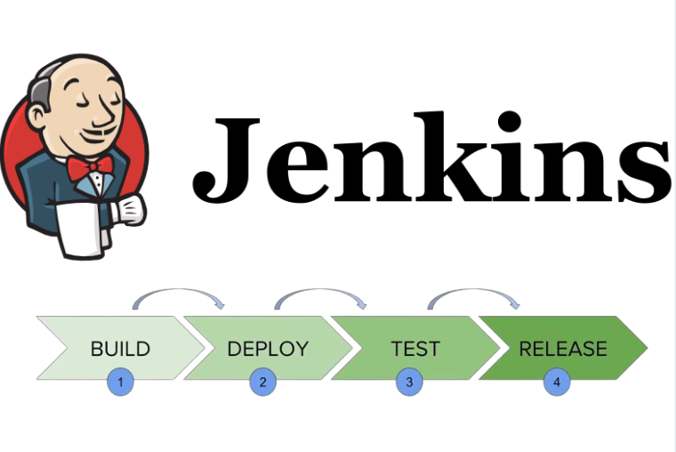

# Checkpoint 17 CICD For Robotics

<a name="readme-top"></a>

## About The Project
This project focuses on setting up a continuous integration (CI) pipeline using Jenkins for a robotics simulation environment. The objective is to automate the CI process, triggering it whenever a commit is pushed to a remote repository. This ensures that the code is continuously tested and validated, promoting a more efficient and error-free development process.



> __Warning__
 This project requires files not provided on this repository.

<!-- GETTING STARTED -->
## Getting Started

### Software Prerequisites
* Ubuntu 20.04
* ROS2 Galactic
* Docker

<p align="right">(<a href="#readme-top">back to top</a>)</p>

<!-- INSTALLATION -->
### Installation
1. Clone the repo inside ros2_ws/src/
   ```sh
   cd /home/user/ros2_ws/src && \
   git clone https://github.com/pvela2017/The-Construct-CheckPoint-17-CI-CD-ROS2 && \
   mv The-Construct-CheckPoint-17-CI-CD-ROS2 ros2_ci
   ```
2. Docker instalation
   ```sh
   sudo apt-get update && \
   sudo apt-get install -y docker.io docker-compose && \
   sudo service docker start
   ```
3. Docker configuration
   ```sh
   sudo usermod -aG docker $USER && \
   newgrp docker
   ```
<p align="right">(<a href="#readme-top">back to top</a>)</p>


<!-- USAGE of the simulation -->
## Simulation Usage 
1. Test:
  ```sh
  cd /home/user/ros2_ws/src/ros2_ci/docker && \
  docker-compose up
  ```

## Jenkins Test
1. Start jenkins:
  ```sh
  bash ~/webpage_ws/start_jenkins.bash
  ```
2. Copy the url from :
  ```sh
  cat ~/jenkins__pid__url.txt
  ```
3. Log :
  ```sh
  user: admin
  pw: 402e4b9cc7c744f19249c186070498fa
  ```
4. Modify the README.MD file

5. Create a pull-request


<!-- KEYS -->
## Key Topics Learnt
* Setup Jenkins.
* Run Gazebo Headless.
